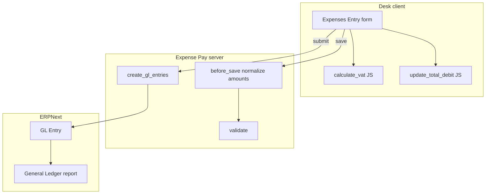
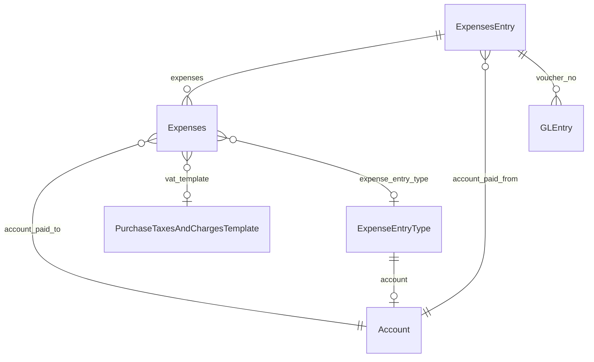
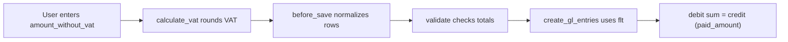
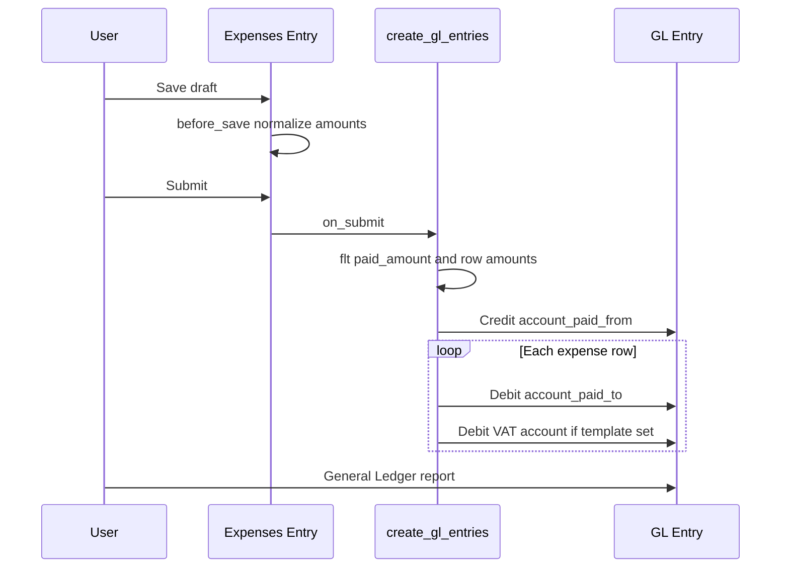

# Expense Pay — Introduction

[README](../README.md) · [Changelog](CHANGELOG.md)

Expense Pay adds **Expenses Entry**, a submittable voucher that splits one payment across multiple expense lines (with optional VAT) and posts balanced **GL Entry** rows on submit.

## Table of contents

- [Architecture overview](#architecture-overview)
- [DocType model](#doctype-model)
- [VAT amount normalization](#vat-amount-normalization)
- [Submit and GL posting flow](#submit-and-gl-posting-flow)

## Architecture overview

## DocType model

## VAT amount normalization

Child-table fields `amount_without_vat` and `vat_amount` are **Float** fields. Without rounding, VAT computed as `(amount_without_vat × rate) / 100` can produce values such as `48.91305`, while `paid_amount` (Currency) is stored at two decimal places. GL debits then sum to a different total than the credit line.

**Fix (v0.2.3):** amounts are rounded to currency precision on the client, normalized again in `before_save`, and rounded when building GL entries.

| Step | Location | Behavior |
|------|----------|----------|
| Client VAT | `expenses_entry.js` | `flt()` on `amount_without_vat`, `vat_amount`, `amount` |
| Save | `expenses_entry.py` | `_normalize_expense_amounts()` recomputes VAT from template |
| Submit | `create_gl_entry.py` | `flt()` on all debit/credit GL amounts |

## Submit and GL posting flow

**Result:** one credit on **Account Paid From** for `paid_amount`, plus debits per row on expense and VAT accounts, with debits and credit balancing at currency precision.
